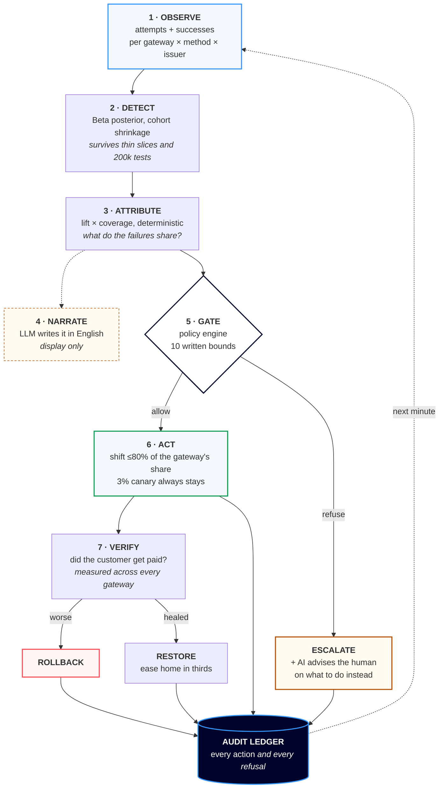

**Detect payment degradation, route around it, prove what it recovered.**

Razorpay AI Buildathon — Track 03, AI Revenue Recovery.

A payment slice degrades — one issuer, on one method, through one gateway — and
money bleeds out for as long as nobody notices. RazorGuard notices, works out
what the failing slices have in common, moves traffic to a healthier gateway
under an explicit written policy, verifies whether that helped, and rolls back
when it did not. Every action *and every refusal* is written to an audit ledger.

The figure it reports for money recovered is measured, not projected: the same
demand runs twice, once with routing off and once with it on, and the difference
is the answer — repeated across seeds, with a confidence interval, in a world
where gateways get worse as you push traffic at them.

---

## In 30 seconds

A payment slice degrades — one issuer, on one method, through one gateway. It is
4% of volume, so the headline success rate barely moves and nobody pages. The
money leaves quietly.

RazorGuard watches at that grain, notices, works out what the failing slices have
in common, moves traffic to a healthier gateway under written bounds, checks
whether that helped, and rolls back when it did not.

```bash
git clone <this-repo> && cd razorguard
pip install -r requirements-dev.txt
python -m razorguard.demo          # 20s — watch one incident, decision by decision
```

**₹1,22,91,379 recovered per two days** (95% CI ₹1,17,94,730 – ₹1,27,88,027),
measured against a control arm rather than projected. Zero of eight seeds lost
money. 202 tests.

---

## How it works



Everything on the solid path is **deterministic**. The two dashed/amber boxes are
where a language model is used, and neither can change a decision.

---

## What it actually looks like

`python -m razorguard.demo --incident INC-0-02` — a gateway collapses at 20:05.
This is real output, not a mock-up:

```text
 |d1 20:06  33.3%    276  #.......  ! detection Success rate on gateway 'gw_gamma' fell 27.1
                                                points (90.5% to 63.4%). It spans 7 of 7
                                                alarming slices, 3.0x its share of the fleet,
                                                so the gateway is the common factor.
                                    > proposal  shift upi/hdfc off gw_gamma onto gw_beta,
                                                health read at slice level (356 attempts/5min)
                                    ? decision  move up to 80% of the share gw_gamma holds
                                                onto gw_beta, which is running 26.7pp better
                                    * action    moved 14.4% of upi/hdfc gw_gamma -> gw_beta

 |d1 20:12  25.0%     52  ........  < rollback  destination gw_beta fell to 84.1% against a
                                                90.5% baseline on 82 attempts; reverted to
                                                baseline weights and escalated

 |d1 20:27  36.7%     79  ##......  ? decision  our last 20 shifts changed the affected keys
                                                by -1.01pp on average, so rerouting is making
                                                things worse rather than better. Halting all
                                                shifts for 120 min and escalating.
                                                rule: efficacy_breaker
```

Three things in twenty lines: it **detected and attributed** a gateway-wide
outage, it **undid its own action** when the destination turned out worse, and
it **stopped itself entirely** when it measured that its whole strategy had
stopped paying.

That last one is the part most systems do not have.

---

## "Razorpay already has Optimizer"

Correct, and that is not what this is for.

Razorpay [published the smart-routing work in 2021](https://arxiv.org/abs/2111.00783)
— logistic regression for downtime prediction, a random forest scoring terminal
success probability, 4–6% improvement in production. They have shipped this.
Nobody needs a student's version of it.

**What this submission is actually demonstrating is the harder half: how you
would know whether any of it worked.**

Routing around a degraded gateway is the easy idea. The difficult questions are
the ones a payments team lives with afterwards — *did the customer actually get
paid, or did we just move the failure somewhere the dashboard is prettier? Is
that number a measurement or a projection? What did the intervention cost? When
is the intervention worse than doing nothing, and would we notice?*

This repository answers those, and each answer changed the code:

- The recovery figure is a **difference between two runs of bit-identical
  demand**, and the run refuses to report it if the arms diverge.
- A guardrail I had defended in writing turned out to be **costing 61% of the
  available recovery**. Measured, then changed.
- A sweep found fleets where rerouting **loses money at every setting**. The
  system now measures the realised effect of its own actions and halts when they
  stop paying.
- The gross figure is reported **net of processing fees**, because moving volume
  between acquirers is not free.

None of that is a routing algorithm. It is the evaluation discipline you would
want around one — and it is the part that does not come free with the product.

---

## Result

**₹1,22,91,379 recovered per two days, 95% CI ₹1,17,94,730 – ₹1,27,88,027.**
38.2% ± 1.8% of the money the incidents put at risk. **Zero of eight seeds lost
money.**

```
python -m razorguard.validate --seeds 8 --days 2
```

| across 8 paired seeds | mean | sd | min | max |
|---|---:|---:|---:|---:|
| revenue recovered | ₹1,22,91,379 | ₹5,93,968 | ₹1,12,78,430 | ₹1,31,17,900 |
| share of exposure | 38.2% | 1.8% | 35.6% | 41.0% |
| success rate gain | 0.576pp | 0.019 | 0.542 | 0.604 |
| routing actions | 99.8 | 4.5 | 92 | 106 |
| rollbacks | 37.5 | 4.7 | 32 | 47 |

A single seed cannot distinguish "the router recovers money" from "this sequence
of coin flips favoured the treatment arm", so the headline is the interval. The
comparison is **paired** — control and treatment face bit-identical demand within
each seed.

One seed in detail (`python -m razorguard.experiment`):

| | router off | router on | delta |
|---|---:|---:|---:|
| attempts | 1,966,458 | 1,966,458 | 0 |
| successful payments | 1,829,522 | 1,840,974 | **+11,452** |
| overall success rate | 93.04% | 93.62% | **+0.58pp** |
| revenue | ₹240.43 cr | ₹241.64 cr | **+₹1.20 cr** |

**Net of what the recovery cost: ₹1,19,01,967.** Rerouting is not free
— acquirers price differently, so moving volume changes what the merchant pays.
Incremental fees came to ₹1,38,653, 1.1% of gross.

The asymmetry there is worth knowing: **UPI carries zero MDR by regulation in
India**, so a UPI recovery is free and a card recovery is not. That falls out of
the arithmetic rather than being special-cased, and it means the economics of a
recovery depend on which method degraded.

Cross-checked independently: measured recovery ₹1.20 cr, while incident exposure
fell ₹1.27 cr. The ~5% gap is itself informative — it is largely the congestion
the router *causes* at the destination, which costs revenue without reducing
incident exposure. Before gateways had capacity limits these two numbers agreed
within 1.5%; the divergence appeared the moment loading a gateway had a price.

---

## Three things the measurements changed

Each was designed one way and rebuilt after the numbers disagreed.

### The policy caps were costing 61% of the recovery

`max_shift_fraction` was set to 40% a priori — the cautious choice. The
hypothesis was that `capacity.py` would justify it: gateways degrade under load,
so shifting harder should congest the destination and stop paying. `stress.py`
measured that and it was wrong.

```
python -m razorguard.stress --days 2
```

| shift cap | recovered | of exposure | actions | rollbacks | peak u | congested |
|---:|---:|---:|---:|---:|---:|---:|
| 20% | ₹41,47,580 | 12.8% | 134 | 26 | 0.74 | 0.2% |
| 40% | ₹78,20,670 | 24.2% | 128 | 32 | 0.79 | 0.5% |
| 60% | ₹1,04,52,600 | 32.4% | 115 | 32 | 0.78 | 2.1% |
| **80%** | **₹1,23,25,460** | **38.2%** | 114 | 39 | 0.83 | 2.7% |
| 100% | ₹1,27,00,650 | 39.3% | 91 | 37 | 0.87 | 4.3% |

The cap bound hard and the congestion it guarded against never arrived — at
100%, the destination lost 707 payments to load against ~11,700 recovered. The
default moved to **80%**, the knee: it captures nearly everything available at
100% (38.2% against 39.3%) with less congestion. Going to 100% buys 3% more
recovery and is not obviously worth it.

Re-run the sweep after touching the capacity model; that curve is what sets the
constant.

### The detector ensemble beats both members

The benchmark already showed neither detector dominated: at a matched
false-alarm budget the fixed rule caught more incidents, the posterior detector
was faster. That is precisely when a union is worth building.

At ≤1 false alarm per 1,000 slice-hours:

| detector | detected | median time to detect |
|---|---|---|
| `fixed_threshold` (floor 0.70, 3 min) | 16 / 18 | 6.5 min |
| `posterior_drop` (8pp, conf 0.90) | 12 / 18 | 3.5 min |
| **`union` (floor 0.70 + 5pp/0.99)** | **16 / 18** | **5.0 min** |

Same detection as the best single detector, 1.5 minutes faster. Both members run
tighter inside the union than they would alone, because false alarms add across
members — which is why the comparison only means anything at a matched budget.
Shipped as `detectors.default_detector()`.

### Rerouting is not always beneficial, and the system now knows it

The 80% cap was chosen against one congestion curve — and that curve is a
plausible shape, not a measured one. So `sensitivity.py` sweeps the cap against
four curves at once, from an acquirer with plenty of headroom to one that falls
over early.

```
python -m razorguard.sensitivity --days 2
```

| curve | 20% | 40% | 60% | 80% | 100% |
|---|---:|---:|---:|---:|---:|
| forgiving | 6.6% | 22.1% | 32.4% | 41.9% | 43.6% |
| shipped | 6.6% | 22.0% | 30.6% | 37.3% | 38.5% |
| **brittle** | **0.2%** | **−2.8%** | **−3.0%** | **−4.0%** | **−5.1%** |
| **severe** | **−0.4%** | **−0.8%** | **−0.1%** | **−0.9%** | **−0.1%** |

On the bottom two rows **every setting loses money**. Those fleets are already
past their capacity knee at rest, so there is no spare headroom to route into
and shifting traffic only concentrates load. No per-action guardrail can see
this — each individual shift looks perfectly reasonable.

*(An earlier version of this report divided one negative recovery by another,
produced `−302%`, and printed a reassuring verdict. The arithmetic bug is fixed
and the finding it hid is the reason the next paragraph exists.)*

So the system now measures **the realised effect of its own shifts**. Twenty
minutes after each one it compares the key's success rate across *every* gateway
— because moving traffic off a sick gateway trivially improves that gateway;
the question is whether the customer got paid. If the recent record says the
shifts are making things worse, it halts all routing and escalates.

It behaves proportionally: 0 trips on `forgiving`, 1 on `shipped`, 2 on
`brittle`, 6 on `severe`. The insurance costs about **₹65,000 of the headline —
0.5%** — and roughly halves the damage where the strategy does not work. It does
not eliminate it, and the honest statement is that **this system needs acquirers
with spare capacity to be worth deploying.**

---

## Why the evaluation is trustworthy

Most detection projects built on synthetic data are circular: you write a rule
that decides which rows are bad, train a model to learn that rule, then report
how well it learned it. You have measured your own generator.

Nothing here learns a label.

**We schedule the outages.** For each incident we know the minute it began,
which slices it touched and how deep it went — and the detector sees none of
that. It sees `(slice, minute, attempts, successes)` and nothing else.

**Demand is identical across arms.** Every random draw is keyed by its own
coordinates — `(seed, minute, method, issuer)` for demand, `(seed, minute,
slice)` for outcomes — rather than pulled from one shared stream, which would
desynchronise the moment the arms made different numbers of draws. The
experiment prints total attempts for both and **refuses to report a recovery
figure if they differ**.

**Gateways are not infinitely elastic.** `capacity.py` degrades a gateway's
success rate past a utilisation knee, so the router's own actions have a price
and diverting traffic onto a healthy destination can congest it. This is what
finally exercises the rollback path against something other than noise.

**The control arm is not crippled.** It runs the same detector and raises the
same alarms; it simply may not act. Tests assert it takes zero routing actions.

---

## Run it

```bash
pip install -r requirements.txt        # or requirements-dev.txt to run the tests

python -m razorguard.validate   --seeds 8 --days 2   # the headline, with a CI
python -m razorguard.experiment --days 2             # one seed, in detail
python -m razorguard.stress     --days 2             # are the caps costing money?
python -m razorguard.showcase                        # the whole story, six acts
python -m razorguard.demo                            # replay an incident
python -m razorguard.bench      --days 2             # detector head-to-head
python -m razorguard.sweep      --budget 1.0         # matched false-alarm curve
python -m razorguard.sensitivity --days 2            # does the cap depend on a guess?
python -m razorguard.narrate    --claude             # LLM note vs template
python -m razorguard.investigate "why did traffic move at 03:12?"
python -m razorguard.execute    --limit 6            # Razorpay test mode, dry run
streamlit run app.py                                   # operator console

docker compose up --build                              # service + console
pytest -q                                              # 202 property tests
```

Deterministic under `--seed`. Every figure below is copied from those commands'
output, and **`tests/test_documented_claims.py` fails if any of them stops
matching `bench/results/*.json`** — so a stale number in this README is a broken
test, not something a reader has to catch. The PDFs go further and interpolate
their figures directly.

**What is invented and what is measured:** the world is simulated and the
measurement is real. [`DATA.md`](DATA.md) lists every invented constant —
ticket sizes, traffic mix, success rates, the congestion curve — and says which
results depend on which.

---

## The detector

A slice carrying four attempts a minute swings between 50% and 100% on noise
alone, so a z-score on it is meaningless. And we run 207,360 tests over two
days, so at any fixed per-test significance level the false-alarm count scales
with the fleet and the alert channel drowns.

`PosteriorDropDetector` handles both by pooling. Each slice's current rate is a
Beta posterior whose prior is centred on its own method's pooled rate with
`prior_strength` pseudo-observations. A thin slice is dragged toward its cohort
and cannot alarm on three unlucky failures; a fat slice overwhelms the prior and
speaks for itself. It alarms only when `P(rate ≤ baseline − min_drop) ≥
confidence`. The baseline carries a 15-minute lag so a degradation in progress
cannot become the normal it is compared against.

At its shipped default the *fixed* rule reaches 18/18 in 3.5 min — while firing
581 false alarms, **168 per 1,000 slice-hours**. It is unusable, and the number
proving it is in the sweep. Comparing detectors at whatever thresholds they ship
with is how that gets hidden.

---

## Where AI is used, and where it is refused

Two places, and the difference between them is the whole design.

**Deciding — never.** Root-cause attribution is deterministic: lift with
coverage over the alarming population, ranked so an explanation missing half the
alarms cannot win however high its lift. A test asserts that `policy.py`,
`routing.py`, `control_plane.py` and `audit.py` cannot even import a model.
A sampled token in the path of a money-moving action cannot be reproduced,
reviewed, or defended.

**Explaining — genuinely agentic.** `investigator.py` answers the question an
on-call engineer actually asks:

```bash
python -m razorguard.investigate "why did traffic move off gw_beta at 03:12, and did it help?"
```

Claude gets four read-only tools over the run — search the audit ledger, pull
per-minute traffic for a slice, check a key's health across *every* gateway
serving it, and rank slices worst-first — and decides for itself what to query,
reading results and following up until it can answer. Multi-step tool use, not
a fixed report with a model stapled to the end.

It is safe for the same reason it is useful: **every tool reads, none write**,
there is no path from an answer back into a routing decision, and it is *as
blind as the detector was* — it cannot import `scenarios.py`, so it reasons only
from what the system actually saw. An investigator holding the answer key would
be theatre. Tests enforce all three.

**Advising — where the rulebook runs out.** Hard bounds say *no* precisely and
say nothing else. When one fires, the system escalates with a correct refusal
and no next step, which leaves a human exactly where they started.

`advisor.py` runs on escalations only. It investigates with the same read-only
tools and returns one of six recommendations — contact the issuer, add capacity,
manual reroute, pause automation, monitor, insufficient evidence — with its
reasoning and the evidence it cited.

The division is deliberate. **Choosing a destination** is an argmax over two or
three candidates with a confidence check: a model there would be slower,
non-reproducible, and no more accurate — the ledger would stop being
deterministic. **Deciding what to do when routing cannot help** is judgement,
because the useful answer depends on the shape of the evidence. So the model
gets the residual and the arithmetic keeps the rest. Advice is recorded as
advice, reaches the alert, and no routing decision reads it.

The LLM (`narrator.py`, Claude Opus 5) is handed the *finished* attribution and
asked to write it as English for the operator console. It never sees raw
traffic, is never asked what caused the incident, and its output is never read
by anything that decides. A test asserts the prompt contains no slice keys and
no per-minute counts; another asserts that `policy.py`, `routing.py`,
`control_plane.py` and `audit.py` do not import the narrator at all. **The
ledger always keeps the deterministic template**, because a ledger whose text
changes when you re-read it is not a ledger.

Off by default, and safe either way: no key, a network error, a refusal and an
empty completion all fall back to the template. The handler is deliberately
broad — with no credential the SDK raises a bare `TypeError` from header
construction, which a typed `except anthropic.*` chain sails past and turns a
cosmetic feature into a crash mid-incident. It disables itself after the first
failure, so a missing key costs one failed round trip rather than one per alarm.

Attribution also declines to overclaim. Below five alarming slices it refuses to
name a secondary dimension and says so:

```
Success rate on gateway 'gw_gamma' fell 20.6 points (91.4% to 70.8%).
It spans 3 of 3 alarming slices. Too few slices have alarmed to narrow
it below the gateway yet.
```

---

## Bounded, gated, reversible

The detector decides *whether something is wrong*. The policy engine decides
*whether we may act on it*. A confident detector is not authorisation to move
money.

| rule | bound |
|---|---|
| `min_confidence` | 0.95 posterior confidence before money moves |
| `min_drop_pp` | ignore drops under 4pp |
| `max_shift_fraction` | ≤80% of the source gateway's share, per action |
| `max_cumulative_divergence` | ≤90% of a key away from baseline at once |
| `action_cooldown` | 15 min before the same key is touched again |
| `max_causes_per_hour` | 4 distinct root causes, then **escalate** |
| `max_actions_per_hour` | 60 weight changes — the hard ceiling |
| `min_target_advantage_pp` | destination must be ≥8pp healthier |
| `no_healthy_destination` | every route degraded ⇒ escalate, never shuffle |
| `min_target_attempts` | 60 attempts before a destination's health is trusted |

**The anti-oscillation budget counts causes, not weight changes.** One gateway
outage legitimately requires shifting every (method, issuer) key that gateway
served, and charging that fan-out against an oscillation budget conflates "the
system is thrashing" with "one incident was wide". An earlier design counted
actions, spent its whole hourly budget on the first outage and escalated
everything after it.

**The canary.** A drained gateway emits no observations, so you lose the ability
to tell whether it recovered — and can never route back. Weights never fall
below a 3% floor, and that trickle is the only reason recovery is observable.

**Rollback.** Both sides stay under watch through the same pooled estimator that
chose the destination. If it falls more than 6pp below its own baseline on
trustworthy volume, weights reset and the incident escalates. Recovery eases
home in thirds.

### Reading health when there is barely any traffic

At 03:00 a slice may see four attempts in five minutes. Refusing outright left
overnight outages unattended, so the estimator widens in declared steps:

```
slice/5min  ->  slice/20min  ->  gateway+method  ->  gateway
   +0pp            +1pp             +3pp             +5pp
```

Each step charges a **coarseness penalty** on the advantage a destination must
show, because pooling across issuers can hide an issuer-specific fault there.
The level used is written into the audit entry. This took the two 03:10 outages
from **0 routing actions to 11 and 8**.

### Issuer-side faults

Several incidents receive zero routing actions, and that is correct.
`issuer_degradation` hits every gateway serving that issuer at once — all routes
terminate at the same bank, so no healthy destination exists. The system
recognises the signature and **escalates under `no_healthy_destination`** rather
than shuffling traffic between equally broken routes.

---

## Executing against Razorpay

Razorpay's public API does not expose gateway routing weights to a third party —
acquirer selection is Razorpay's own product (Optimizer), not a merchant
endpoint. A project claiming to "reroute traffic through the Razorpay API" is
describing something that does not exist.

So routing stays inside the simulation where it can be measured, and
`executor.py` demonstrates the half that *is* real: each recovery decision
creates a genuine **test-mode Order** carrying the decision context in `notes` —
audit sequence, source and destination gateway, the reason — so it is auditable
from the Razorpay dashboard.

Dry run is the default. Live calls require both environment variables *and*
`--live`, and a key not beginning `rzp_test_` is refused outright. Two tests
assert that refusal.

**This has been run.** Against a Razorpay test account: 6 of 6 orders created,
plus payment links. One was fetched back to confirm it is a real record rather
than a successful POST:

```text
id      : order_TYDrGJBKKSVf3x        status  : created
amount  : 64000  (Rs 640.00)          receipt : rg-4
notes   : razorguard_audit_seq : 4
          razorguard_subject   : upi|sbi
          razorguard_from      : gw_beta
          razorguard_to        : gw_alpha
          razorguard_reason    : moved 25.6% of upi/sbi from gw_beta to gw_alpha
```

That is why the decision context goes on the order: the reasoning behind a
recovery is readable from the Razorpay dashboard, outside this repository
entirely.

---

## Layout

```
app.py              operator console (streamlit)
razorguard/
  config.py         the fleet: gateways, methods, issuers, volumes, tickets
  capacity.py       gateways degrade under load; the router's actions have a price
  scenarios.py      injected degradations - ground truth, unreadable by detectors
  simulator.py      open-loop traffic, for detector benchmarking
  world.py          closed-loop traffic: demand, routing, health, congestion
  detectors/        fixed threshold; Beta-posterior drop; the shipped union
  rootcause.py      deterministic lift-with-coverage attribution
  narrator.py       optional LLM prose over that attribution; template fallback
  investigator.py   agentic post-hoc investigation over the ledger, read-only
  advisor.py        recommends a course of action where the policy escalates
  economics.py      MDR per route; gross recovery net of what it cost
  policy.py         the bounds, the stopping rules, the reasons
  routing.py        weight table, canary floor, gradual restore
  control_plane.py  observe -> detect -> attribute -> gate -> act -> verify -> roll back
  audit.py          append-only ledger, refusals included
  executor.py       Razorpay test-mode execution, dry run by default
  metrics.py        TTD, false alarms per 1k slice-hours, exposure
  bench.py sweep.py detector benchmarks
  sensitivity.py    does the 80% cap depend on a curve we guessed?
  applier.py        the last mile: delivering a recommendation to something
  experiment.py     control vs treatment - one seed
  validate.py       paired multi-seed validation with a confidence interval
  stress.py         does shifting harder recover more?
  ingest.py         the seam where real payment outcomes replace the simulator
  service.py        HTTP service: same loop, wall-clock timer, live data
  persistence.py    durable state; a restart replays rather than starts blind
  security.py       request signing / bearer auth for the ingest endpoint
  alerts.py         escalations to a webhook, off the loop's thread
  demo.py narrate.py execute.py
docs/               the two project PDFs, generated from bench/results
DEPLOY.md           running it against real traffic, and what is still missing
DATA.md             every invented constant, and which results depend on it
SUBMIT.md           submission checklist, video script, panel prep
tests/              202 property tests
```

`pyflakes` clean. No result value is hardcoded anywhere in `razorguard/` —
a test asserts it.

**On the branding.** The mark, wordmark and console theme are original artwork.
Razorpay's palette and design language are referenced deliberately — this is a
submission to their buildathon and it should look like it belongs beside their
product — but their logo is not reproduced anywhere in this repository.

---

## Deploying it

`docker compose up --build` gives you the service on `:8000` and the console on
`:8501`. Real payment outcomes go in at `POST /ingest` as aggregated counts —
`(gateway, method, issuer, attempts, successes)`, which is all the detector ever
needed — and recommendations come out at `GET /routing`.

The deployed path is the benchmarked path: the service calls
`ControlPlane.tick`, which is exactly what `run` calls, and a test asserts the
two produce identical results.

| | |
|---|---|
| **Durable state** | SQLite in WAL mode, checkpointed each tick. A restart replays the stored stream back through the detector, restores the routing table and re-adopts open diversions — the last of those matters most, because restored weights with no supervisor watching them is worse than either extreme. |
| **Authentication** | HMAC request signing or a bearer token on `/ingest`. The service refuses to start without one; open is something you opt into, not something you forget. |
| **Alerting** | Escalations and rollbacks to a webhook, on their own thread with a bounded queue. A dead incident channel can never stall the control loop. |
| **Observability** | Prometheus at `/metrics`, JSON logs, per-tick duration, ingest and alert counters. |
| **Failover** | A lease in the shared store elects one active instance; standbys take over if it stops renewing. A stalled node that loses its lease cannot finish the tick it was in — it must stand down. Failover, not horizontal scaling: two instances each seeing half the stream would both misjudge the fleet. |
| **The last mile** | `applier.py` delivers recommendations to a webhook or an atomically-written config file, in `off` / `notify` / `auto` modes. Only changed keys are pushed. |

It emits recommendations and does not apply them, because acquirer selection is
not an endpoint a third party can call. `DEPLOY.md` covers the integration, the
three ways to act on the output, and what is genuinely still open — chiefly a
capacity curve calibrated to real acquirers rather than a plausible shape.

---

## Limits

- **The world is simulated.** Gateway health, demand, incidents and the
  congestion curve are ours. What is *not* ours is the detector's view of them,
  which is the part under evaluation. A deployment replaces `world.py`.
- **This needs acquirers with spare capacity.** On a fleet already past its
  capacity knee, rerouting cannot help and the sweep shows it loses money at
  every setting. The efficacy breaker limits the damage rather than removing it.
- **The congestion curve is a plausible shape, not a measured one.** Knee at 70%
  utilisation, ~10% success-rate loss at 100% of capacity. Across the curves
  where routing helps at all, holding 80% costs at most 3.9% — so the guess is
  not load-bearing *for that choice*. It is load-bearing for whether the system
  helps at all.
- **38% of exposure, not 90%.** Detection latency and the remaining caps set
  that ceiling.
- **~39 rollbacks against ~103 actions.** Each is a case where the destination
  proved worse and the system undid itself. Reported rather than tuned away.
- **Eight seeds, one incident plan.** The interval covers traffic randomness,
  not the choice of which incidents occur.
